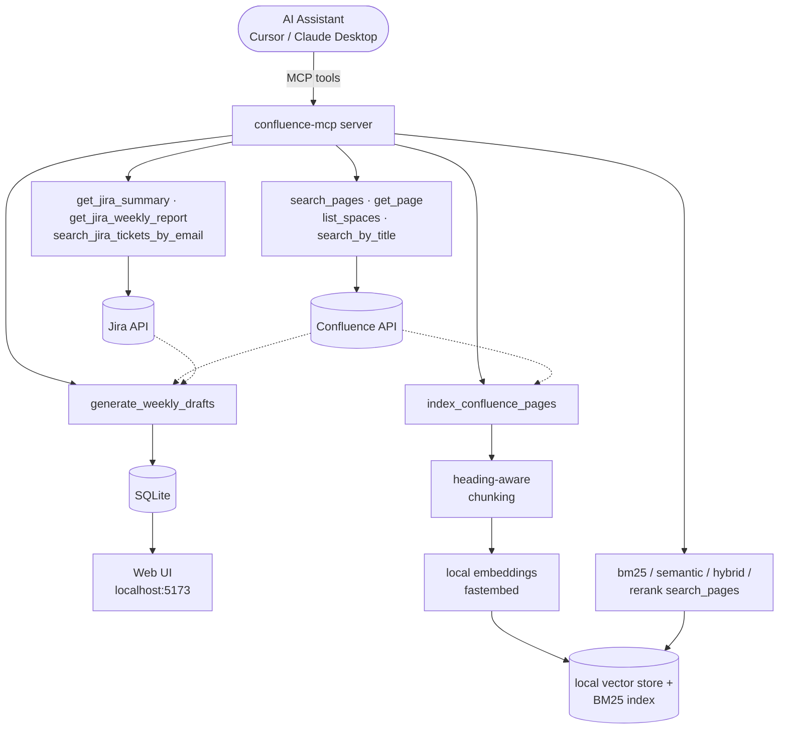
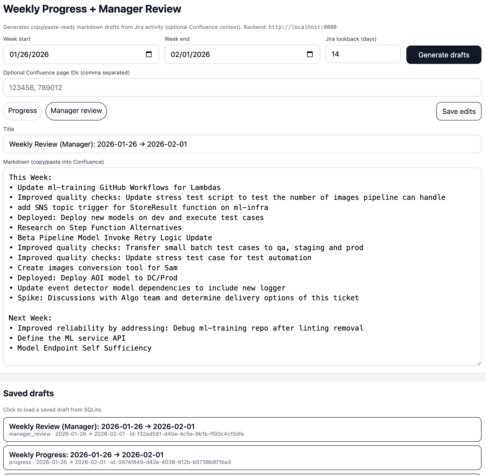

# Confluence MCP Server

A Model Context Protocol (MCP) server that enables AI assistants to search and retrieve content from Confluence pages. This allows AI to understand context and design documentation before making changes.

## Features

- **Search Confluence Pages**: Search for pages by title, content, or keywords
- **Retrieve Page Content**: Get full page content including body, metadata, and attachments
- **List Spaces**: Browse available Confluence spaces
- **Get Page by ID**: Retrieve specific pages by their Confluence ID
- **Context-Aware Operations**: AI can understand existing documentation before suggesting changes
- **Weekly status drafting (full-stack)**: Generate **weekly progress** and **weekly manager review** drafts from Jira activity, edit in a small web UI, and copy/paste into Confluence
- **Hybrid search + reranking (RAG)**: Index Confluence pages into a local vector store, then search by vector similarity, local BM25 keyword matching, both fused via Reciprocal Rank Fusion, or fused-and-reranked by a local cross-encoder — with a Recall@k/MRR evaluation harness to compare them. See [docs/RAG.md](docs/RAG.md)

## How It Works



Three groups of tools sit behind one MCP server: **direct Confluence/Jira lookups**
(hit the Atlassian APIs live), **weekly status drafting** (pulls from both APIs,
renders via Jinja templates, and persists to SQLite for the web UI), and **local
hybrid search** (indexes pages once into a local vector + BM25 index, then serves
`bm25_search_pages` / `semantic_search_pages` / `hybrid_search_pages` /
`rerank_search_pages` from it without hitting Confluence again). See
[docs/RAG.md](docs/RAG.md) for the indexing and retrieval pipeline in detail,
including why it fuses BM25 + vector search via RRF and reranks with a cross-encoder.

## Problem this solves

Weekly updates are easy to forget and hard to write consistently. This project turns your Jira activity (optionally combined with a few Confluence “context” pages) into manager-ready weekly drafts with a repeatable structure: highlights, progress, risks, next steps, and asks.

## Screenshot



## Prerequisites

- Python 3.11+ recommended (works with your existing MCP setup)
- Confluence Cloud or Server instance
- Confluence API token or username/password for authentication
- Node.js 18+ (for the web UI)

## Installation

### Option A: Using `venv` (recommended)

1. Create a venv and install dependencies:
```bash
python3 -m venv .venv
.venv/bin/python -m pip install -r requirements.txt
```

2. Configure by creating a `.env` file:
```bash
cp env.example .env
# Edit .env with your Confluence credentials
```

### Option B: Docker Compose

```bash
docker compose -f docker-compose.yml up --build
```

## Configuration

The server requires the following environment variables:

- `CONFLUENCE_URL`: Your Confluence instance URL 
  - For Cloud: `https://your-domain.atlassian.net`
  - For Server: `https://confluence.your-domain.com`
- `CONFLUENCE_EMAIL`: Your Confluence email/username
- `CONFLUENCE_API_TOKEN`: Your Confluence API token (preferred) or password

**Note:** The server automatically detects Confluence Cloud vs Server and uses the correct API endpoints (`/wiki/rest/api/` for Cloud, `/rest/api/` for Server).

### Getting a Confluence API Token

1. Go to https://id.atlassian.com/manage-profile/security/api-tokens
2. Click "Create API token"
3. Copy the token and use it in your configuration

## Quick Start

1. **Test your connection:**
```bash
python3 python/test_connection.py
```

2. **Start the weekly draft backend API:**

```bash
PYTHONPATH="python/backend:python:." .venv/bin/python -m uvicorn app.main:app --host 0.0.0.0 --port 8000
```

3. **Start the web UI:**

```bash
cd frontend
npm install
npm run dev
```

Then open `http://localhost:5173`.

4. **Configure your MCP client** (see `docs/CONFIGURATION.md` for details)

## Usage

### Testing the Connection

Before configuring your MCP client, test that everything works:

```bash
# Set environment variables or use .env file
export CONFLUENCE_URL="https://your-domain.atlassian.net"
export CONFLUENCE_EMAIL="your-email@example.com"
export CONFLUENCE_API_TOKEN="your-api-token"

# Run the test script
python3 python/test_connection.py
```

### Running as MCP Server

The server implements the MCP protocol and can be used with MCP-compatible clients like Cursor, Claude Desktop, etc.

Configure in your MCP client settings:

```json
{
  "mcpServers": {
    "confluence": {
      "command": "python",
      "args": ["/path/to/confluence-mcp/python/server.py"],
      "env": {
        "CONFLUENCE_URL": "https://your-domain.atlassian.net",
        "CONFLUENCE_EMAIL": "your-email@example.com",
        "CONFLUENCE_API_TOKEN": "your-api-token"
      }
    }
  }
}
```

### Available Tools

1. **search_pages**: Search for Confluence pages by query
   - Parameters: `query` (string), `space_key` (optional), `limit` (optional, default: 10)

2. **get_page**: Get a specific page by ID
   - Parameters: `page_id` (string)

3. **get_page_content**: Get the full content of a page
   - Parameters: `page_id` (string), `expand` (optional, default: "body.storage,version,space")

4. **list_spaces**: List all accessible Confluence spaces
   - Parameters: `limit` (optional, default: 50)

5. **search_by_title**: Search pages by exact or partial title match
   - Parameters: `title` (string), `space_key` (optional), `limit` (optional)

6. **get_jira_summary**: Get a summary of Jira tickets assigned to you from the last N days
   - Parameters: `days` (optional, default: 14), `save_to_file` (optional, default: true)
   - Returns a formatted summary grouped by status and issue type
   - Automatically saves to `2026/YYYYMM/jira_summary_YYYYMMDD.md` if `save_to_file` is true
   - Uses the same Atlassian credentials as Confluence (CONFLUENCE_URL, CONFLUENCE_EMAIL, CONFLUENCE_API_TOKEN)

7. **get_jira_weekly_report**: Generate a high-level weekly report with business benefits
   - Parameters: `days` (optional, default: 14), `save_to_file` (optional, default: true)
   - Analyzes tickets to extract value propositions and formats them for stakeholders
   - Categorizes into "This Week" (Done/In Progress/In Review) and "Next Week" (To Do)
   - Automatically saves to `2026/YYYYMM/weekly_report_YYYYMMDD.md` if `save_to_file` is true
   - Perfect for weekly status updates to management

8. **search_jira_tickets_by_email**: Search for Jira tickets by a specific user's email address
   - Parameters: `email` (required), `days` (optional, default: 14), `search_type` (optional, default: "assignee")
   - Automatically looks up the user's Account ID from their email, then searches for their tickets
   - `search_type` can be: "assignee" (tickets assigned to user), "reporter" (tickets reported by user), or "all" (both)
   - Returns a formatted summary grouped by status
   - Useful for understanding what a team member has been working on
   - **Note**: Jira Cloud requires Account ID (not email) for searches. This tool handles the lookup automatically.

9. **generate_weekly_drafts**: Generate two markdown drafts (weekly progress + manager review)
   - Parameters: `week_start` (optional ISO date), `week_end` (optional ISO date), `jira_days_lookback` (optional), `confluence_page_ids` (optional array), `save_to_files` (optional), `save_to_db` (optional)
   - Saves markdown to `2026/YYYYMM/` and (optionally) stores drafts in SQLite for the web UI

10. **index_confluence_pages**: Chunk, embed, and index Confluence pages for semantic search
    - Parameters: `page_ids` (optional array) or `query` + `space_key` (optional) to discover pages to index, `limit` (optional, default: 20)
    - Splits each page into heading-scoped chunks, embeds them locally, and stores them in a persistent local vector index. Re-indexing a page replaces its previous chunks.

11. **semantic_search_pages**: Vector search over previously indexed page chunks
    - Parameters: `query` (string), `top_k` (optional, default: 5), `space_key` (optional)
    - Returns matching chunk text plus page title, URL, and heading breadcrumb, ranked by semantic similarity rather than keyword overlap. Requires pages to be indexed first via `index_confluence_pages`.

12. **bm25_search_pages**: Local BM25 keyword search over previously indexed page chunks
    - Parameters: `query` (string), `top_k` (optional, default: 5), `space_key` (optional)
    - Keyword ranking over the local index (not Confluence's CQL search) — useful for exact-term lookups within indexed pages and for comparing against the semantic/hybrid tools.

13. **hybrid_search_pages**: BM25 + vector search fused via Reciprocal Rank Fusion
    - Parameters: `query` (string), `top_k` (optional, default: 5), `space_key` (optional), `candidate_k` (optional, default: 20)
    - Catches exact terms that pure vector search can under-rank, while still finding conceptual matches with no shared wording.

14. **rerank_search_pages**: `hybrid_search_pages` candidates, re-scored by a local cross-encoder
    - Parameters: `query` (string), `top_k` (optional, default: 5), `space_key` (optional), `candidate_k` (optional, default: 20)
    - Highest precision, higher latency than the other search tools — recommended default when result quality matters more than speed. See [docs/RAG.md](docs/RAG.md) for design details, tradeoffs, and how to evaluate retrieval quality (Recall@k/MRR) across all four search tools.

## Example Usage

Once configured, AI assistants can use the server like this:

```
User: "Search for pages about database design"
AI: [Uses search_pages tool to find relevant pages]

User: "What does the Beta Pipeline design document say?"
AI: [Uses search_pages to find the document, then get_page_content to retrieve it]

User: "Summarize my Jira tickets from the last 2 weeks"
AI: [Uses get_jira_summary to fetch and summarize tickets, saves to 2026/YYYYMM folder]

User: "Generate a weekly report with business benefits from my Jira tickets"
AI: [Uses get_jira_weekly_report to create stakeholder-friendly weekly update]

User: "What has user@example.com been working on in the last 2 weeks?"
AI: [Uses search_jira_tickets_by_email to find and summarize their tickets]

User: "Generate my weekly progress and manager review drafts for last week"
AI: [Uses generate_weekly_drafts tool, returns two markdown drafts]

User: "Index all pages in the ENG space about our data pipeline"
AI: [Uses index_confluence_pages with query="data pipeline", space_key="ENG"]

User: "How do we handle schema migrations for the events table?"
AI: [Uses rerank_search_pages to find and precisely rank conceptually relevant chunks, even if they never use the word "migration"]
```

## Security Notes

- Never commit your `.env` file or API tokens to version control
- Use API tokens instead of passwords when possible
- The server respects Confluence permissions - users can only access pages they have permission to view
- If you accidentally shared a token in docs or chat, **rotate it immediately** in Atlassian and replace with placeholders

## Troubleshooting

### Authentication Errors
- Verify your API token is correct
- Check that your email matches your Confluence account
- Ensure your Confluence URL is correct (include https://)

### Permission Errors
- The API token must belong to a user with appropriate Confluence permissions
- Some pages may be restricted and require specific permissions

### Connection Errors
- Verify your Confluence URL is accessible
- Check network connectivity
- For Confluence Server, ensure the REST API is enabled

## Development

To extend the server with additional functionality:

1. Add new tools in `python/server.py` following the MCP tool format
2. Implement the Confluence API calls in `python/confluence_client.py`
3. Update this README with new tool documentation

## License

MIT

